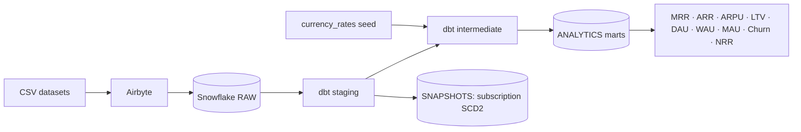

# NimbusIQ Revenue Intelligence

[](../../actions/workflows/ci.yml)

SaaS revenue analytics: **CSV -> Airbyte -> Snowflake -> dbt**, producing
customer, subscription, revenue and usage marts plus the standard SaaS KPIs
(MRR, ARR, ARPU, LTV, DAU/WAU/MAU, churn, NRR).



## What "production-ready" means here

| Area | What is in the repo |
|---|---|
| Security | No secrets in git; env-var driven `profiles.yml`; key-pair auth for CI/prod; least-privilege Snowflake roles (`LOADER`, `TRANSFORMER`, `REPORTER`) instead of `ACCOUNTADMIN`; gitleaks + private-key detection hooks |
| Environments | `dev` / `ci` / `prod` dbt targets; non-prod runs write to `<SCHEMA>_STAGING` etc., never to production schemas; snapshots isolated the same way |
| Data quality | Tests on every staging key, referential integrity, accepted values, ranges, reconciliation tests (ARR = 12 x MRR, fact revenue = payment ledger), dbt unit tests, source freshness, dataset validator |
| Correctness | Payments normalised to USD (the data holds USD/EUR/GBP/INR and used to be summed raw); `PAUSED` subscriptions no longer mapped to `UNKNOWN`; business assumptions moved to `vars` |
| CI/CD | GitHub Actions: lint, Python tests, `dbt parse`, optional Snowflake build in an isolated PR schema (auto-dropped), Docker build, scheduled production deploy with artifacts |
| Reproducibility | Pinned `requirements.txt`, seeded data generators, Dockerfile, Makefile, `.editorconfig`, `.gitattributes` |
| Docs | dbt docs with every model and column described, runbook, migration notes, GitHub setup guide |

## Repository layout

```text
.github/       CI, deploy workflow, Dependabot, PR template
airbyte/       Ingestion configuration notes
datasets/      CSV input data (generated, validated)
docs/          Architecture, runbook, migration notes, GitHub setup
nimbusiq/      dbt project (models, seeds, snapshots, tests, macros, profiles)
scripts/       Seeded dataset generators + validator
snowflake/     Idempotent bootstrap: warehouse, schemas, roles, grants
tests/         Python tests for the scripts
```

## Quick start

```bash
# 1. Snowflake: run snowflake/setup.sql once as ACCOUNTADMIN, then add the public keys.
# 2. Airbyte: sync the CSVs to NIMBUSIQ.RAW (see airbyte/README.md).
# 3. Local environment
python -m venv .venv && source .venv/bin/activate      # Windows: .venv\Scripts\Activate.ps1
pip install -r requirements.txt
cp .env.example .env                                   # fill in your Snowflake login
set -a && source .env && set +a                        # PowerShell: see docs/runbook.md

# 4. Build everything
cd nimbusiq
export DBT_PROFILES_DIR=profiles
dbt deps
dbt debug
dbt seed
dbt build          # models + tests + unit tests + snapshots, in DAG order
dbt docs generate && dbt docs serve
```

`make help` lists the shortcuts (`make build`, `make test`, `make lint`, ...).
Dev runs land in `NIMBUSIQ.<DBT_SCHEMA>_STAGING`, `..._INTERMEDIATE`,
`..._ANALYTICS`; only `--target prod` writes to the real schemas.

## Data model

| Layer | Schema (prod) | Materialisation | Contents |
|---|---|---|---|
| Sources | `RAW` | - | Airbyte tables (read-only for dbt) |
| Staging | `STAGING` | view | 1:1 typed, trimmed, renamed source tables |
| Intermediate | `INTERMEDIATE` | view (events: incremental merge) | USD payments, per-customer aggregates, subscription lifecycle |
| Marts | `ANALYTICS` | table | `dim_customer`, `dim_plan`, `fact_revenue`, `fact_usage`, `fact_subscription`, KPI tables |
| Snapshots | `SNAPSHOTS` | SCD2 | `subscription_snapshot` on `plan_name` and `status` |

### Metric definitions and their limits

* **MRR / ARR** are point-in-time sums over `ACTIVE` subscriptions, not a monthly history.
* **ARPU** is lifetime USD payments per paying customer; **LTV** = ARPU x
  `ltv_lifetime_months` (default 24). Both are illustrative - confirm with finance.
* **NRR** applies the `nrr_expansion_rate` (10 %) and `nrr_contraction_rate` (5 %)
  assumptions because the source data has no plan-change history.
* **FX**: `seeds/currency_rates.csv` holds static, illustrative rates. Swap in a maintained FX feed before using revenue for finance reporting.

Change any assumption without editing SQL: `dbt build --vars '{ltv_lifetime_months: 36}'`.

## CI/CD

| Workflow | Trigger | What it does |
|---|---|---|
| `ci.yml` | PR, push to `main` | ruff, sqlfluff, yamllint, pytest + dataset validation, `dbt parse`, Docker build; with `ENABLE_SNOWFLAKE_CI=true` also `dbt build` in schema `CI_PR_<n>` (dropped afterwards) |
| `deploy.yml` | daily 02:00 UTC, manual | `dbt seed`, freshness, `dbt build --target prod`, docs, uploads artifacts |

Setup steps (secrets, environment, branch protection): [`docs/github-setup.md`](docs/github-setup.md).

## More documentation

* [Architecture](docs/architecture.md) · [Runbook](docs/runbook.md) · [Migration notes](docs/migration-notes.md)
* [Airbyte](airbyte/README.md) · [dbt project](nimbusiq/README.md) · [Contributing](CONTRIBUTING.md) · [Security](SECURITY.md) · [Changelog](CHANGELOG.md)
