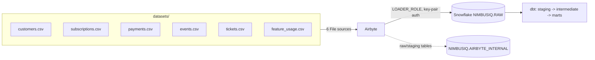

# Ingestion architecture

```mermaid
flowchart LR
    subgraph Files[datasets/]
        C[customers.csv]
        S[subscriptions.csv]
        P[payments.csv]
        E[events.csv]
        T[tickets.csv]
        F[feature_usage.csv]
    end
    Files -->|6 File sources| AB[Airbyte]
    AB -->|LOADER_ROLE, key-pair auth| RAW[(Snowflake NIMBUSIQ.RAW)]
    AB -.->|raw/staging tables| INT[(NIMBUSIQ.AIRBYTE_INTERNAL)]
    RAW --> DBT[dbt: staging -> intermediate -> marts]
```

Tables in `NIMBUSIQ.RAW`: `CUSTOMERS`, `SUBSCRIPTIONS`, `PAYMENTS`, `EVENTS`,
`TICKETS`, `FEATURE_USAGE`.
