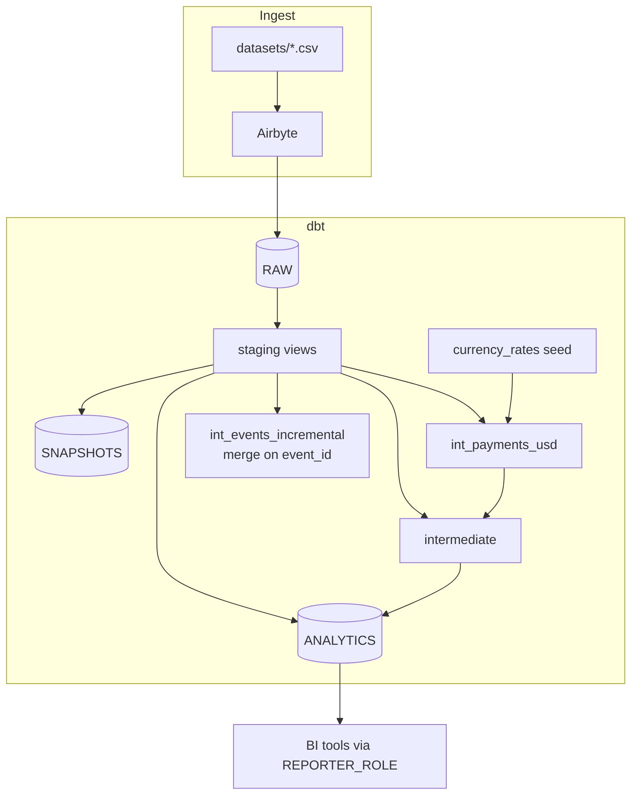

# Architecture

## Key design decisions

1. **Raw is immutable.** Airbyte owns `RAW`; dbt only has `SELECT`.
2. **Environment isolation.** `generate_schema_name` prefixes every non-prod schema with the developer / PR schema, so a laptop or PR can never overwrite production tables or snapshot history.
3. **Idempotent incremental events.** `int_events_incremental` inserts rows whose `event_id` is not in the target (merge key `event_id`), so events arriving late with an old `event_time` are not lost.
4. **Money is always USD downstream.** Currency conversion happens once, in `int_payments_usd`; every revenue metric reads from there.
5. **History is preserved.** Subscription plan/status changes are captured by an SCD Type 2 snapshot (`strategy: check`, hard deletes invalidated).
6. **Fail loudly, degrade gracefully.** Structural problems (duplicate/null keys, orphan rows, negative amounts, reconciliation drift) fail the build; categorical drift only warns.

## Environments

| Target | Used by | Auth | Writes to |
|---|---|---|---|
| `dev` | developers | password (from env) | `<DBT_SCHEMA>_STAGING`, `_INTERMEDIATE`, `_ANALYTICS`, `_SNAPSHOTS` |
| `ci` | pull requests | key pair | `CI_PR_<n>_*` (dropped after the run) |
| `prod` | scheduled deploy | key pair | `STAGING`, `INTERMEDIATE`, `ANALYTICS`, `SNAPSHOTS` |
